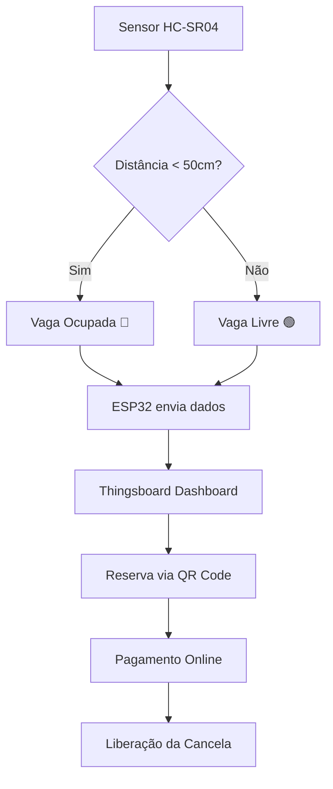

# **Sistema de Parkamento Inteligente com Reserva e Pagamento via QR Code**

## **1. Visão Geral**  
Sistema IoT para monitoramento de vagas de estacionamento em tempo real, com:  
- Detecção de ocupação via sensor ultrassônico (HC-SR04).  
- Dashboard no Thingsboard para visualização de status das vagas, tempo de ocupação e métricas.  
- Reserva de vagas e liberação via QR Code integrado a um sistema de pagamento.  

---

## **2. Componentes do Sistema**  
### **Hardware**  
- **ESP32**: Processamento e comunicação.  
- **Sensor HC-SR04**: Mede distância para detectar se a vaga está ocupada.  
- **Módulo WiFi**: Conexão com o Thingsboard.  
- **Display LCD (opcional)**: Mostrar QR Code para reserva/pagamento na cancela.  

### **Software**  
- **Thingsboard**: Dashboard e armazenamento de dados.  
- **Aplicativo Móvel (opcional)**: Para reservas e pagamentos (pode ser substituído por uma página web).  

---

## **3. Funcionamento por Etapas**  

### **Etapa 1: Detecção de Ocupação**  
- **Sensor HC-SR04** envia dados de distância para o ESP32.  
  - Se distância < 50 cm → Vaga **ocupada** (🔴).  
  - Se distância ≥ 50 cm → Vaga **livre** (🟢).  
- Dados são enviados para o Thingsboard via MQTT/HTTP.  

### **Etapa 2: Dashboard no Thingsboard**  
**Widgets Principais:**  
1. **Mapa de Vagas Interativo**:  
   - Vagas coloridas (livre/ocupada/reservada) com IDs.  
2. **Tempo de Ocupação**:  
   - Relógio contando quanto tempo cada vaga está ocupada.  
3. **Métricas Gerais**:  
   - "Vagas livres: X/Y", "Tempo médio de ocupação: Z min".  
4. **QR Code Dinâmico**:  
   - Gerado para a vaga reservada (link para pagamento/liberação).  

### **Etapa 3: Reserva e Pagamento**  
1. **Reserva no Dashboard**:  
   - Usuário seleciona vaga livre e clica em "Reservar".  
   - Thingsboard gera um QR Code único para aquela vaga (ex.: link `https://pagamento.com/vaga5`).  
2. **Liberação da Cancela**:  
   - Usuário escaneia o QR Code na cancela → página de pagamento é aberta.  
   - Após pagamento, servidor envia comando para Thingsboard liberar a cancela (via API/RPC).  

### **Etapa 4: Alertas e Relatórios**  
- **Notificações**:  
  - "Vaga 3 reservada por 30 minutos".  
  - "Pagamento confirmado – cancela liberada".  
- **Relatórios PDF**:  
  - Histórico de ocupação, receita diária, etc.  

---

## **4. Diagrama de Fluxo**  

